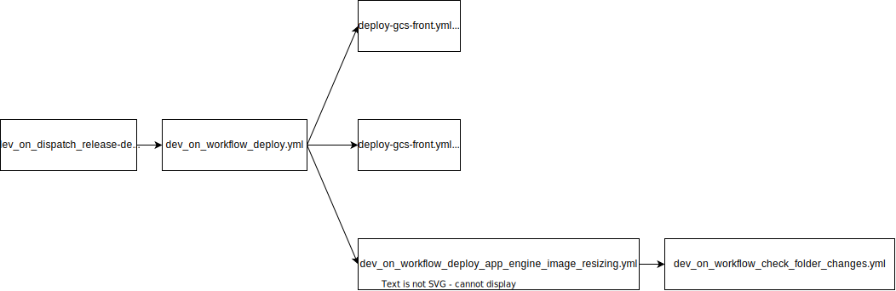
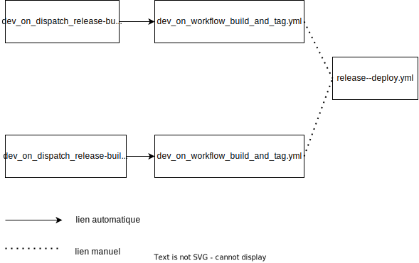

Présentation de la CI
=====================

L'objectif de cette documentation est d'expliquer et présenter l'organisation de la CI/CD via github action sur ce repository.


Description détaillée de dev_on_dispatch_release_deploy.yml
--------------------------------------------

Ce workflow est celui lancé pour faire un déploiement en staging/integration/production. Il fait appel à d'autres workflows:



Description détaillée de dev_on_dispatch_release_build.yml
---------------------------------------

Ce workflow est celui lancé à chaque merge sur la branche master.


Schéma MES/MEP
--------------

Voici les étapes par lesquelles il faut passer pour pouvoir réaliser une MES/MEP





* Le release build et le release hotfix créent une image docker qui sera enregistrée sur l'artifact registry de google. Si cette image n'est pas crée, le dev_on_dispatch_release_deploy.yml échouera.

* Le dev_on_dispatch_release_deploy.yml pour faire son déploiement dépend de deux repositories extérieur à ce repos :
  * **pass-culture-deployment** : ce repository contient les values.yml qui seront passé au chart helm
  * **pcapi-chart** : ce repository contient le chart helm pcapi

Le job **dev_on_dispatch_release_deploy.yml** checkout la version **master** de pass-culture-deployment pour récupérer les values de la release. Pour la dépendance avec pcapi-chart, celle-ci est moins directe. En effect, pcapi-chart permet de build une version du chart helm que l'on envoie sur l'artefacts registry de google. Le lien se fait via le fichier *helmfile.yaml* à la racine de ce repository :

```yaml
helmDefaults:
  wait: true

repositories:
  - name: passCulture
    url: europe-west1-docker.pkg.dev/passculture-infra-prod
    oci: true

releases:
  - name: {{ .Environment.Name }}
    namespace: {{ .Environment.Name }}
    chart: passCulture/pass-culture-artifact-registry/pcapi-chart
    version: {{ .Values.chartVersion }}
    values:
      - {{ requiredEnv "PCAPI_VALUES_FILE" }}
      - {{ requiredEnv "PCAPI_SECRETS_FILE" }}

environments:
  testing:
    values:
      - chartVersion: 0.17.4
  staging:
    values:
      - chartVersion: 0.17.4
  integration:
    values:
      - chartVersion: 0.17.4
  production:
    values:
      - chartVersion: 0.17.4
  ops:
    values:
      - chartVersion: 0.17.4
  perf:
    values:
      - chartVersion: 0.17.4
```

Liste des fichiers
------------------

| Nom du fichier                        | Type     | Trigger       | Liens vers les runs                                                                                   |
|:--------------------------------------|:---------|:--------------|:------------------------------------------------------------------------------------------------------|
| build-and-push-docker-images.yml      | Helper   | Automatically |                                                                                                       |
| dev_on_workflow_check_folder_changes.yml              | Helper   | Automatically |                                                                                                       |
| deploy-app-engine-image-resizing.yml | Helper   | Automatically |                                                                                                       |
| deploy.yml                            | Helper   | Automatically |                                                                                                       |
| mypy-cop.yml                          | Workflow | Automatically | [runs](https://github.com/pass-culture/pass-culture-main/actions/workflows/mypy-cop.yml)              |
| ping_data_team.yml                    | Workflow | Automatically | [runs](https://github.com/pass-culture/pass-culture-main/actions/workflows/ping_data_team.yml)        |
| prepare-cache-master.yml              | Workflow | Automatically | [runs](https://github.com/pass-culture/pass-culture-main/actions/workflows/prepare-cache-master.yml)  |
| dev_on_schedule_prepare_cache_weekly.yml              | Workflow | Automatically | [runs](https://github.com/pass-culture/pass-culture-main/actions/workflows/dev_on_schedule_prepare_cache_weekly.yml)  |
| dev_on_dispatch_release_build_hotfix.yml             | Workflow | Manually      | [runs](https://github.com/pass-culture/pass-culture-main/actions/workflows/dev_on_dispatch_release_build_hotfix.yml) |
| dev_on_dispatch_release_build.yml                    | Workflow | Manually      | [runs](https://github.com/pass-culture/pass-culture-main/actions/workflows/dev_on_dispatch_release_build.yml)        |
| dev_on_dispatch_release_deploy.yml                   | Workflow | Manually      | [runs](https://github.com/pass-culture/pass-culture-main/actions/workflows/dev_on_dispatch_release_deploy.yml)       |
| reusable--build-and-tag.yml           | Helper   | Automatically |                                                                                                       |
| storybook.yml                         | Workflow | Automatically | [runs](https://github.com/pass-culture/pass-culture-main/actions/workflows/storybook.yml)             |
| tests-api.yml                         | Helper   | Automatically |                                                                                                       |
| dev_on_dispatch_release_build.yml                        | Workflow | Automatically | [runs](https://github.com/pass-culture/pass-culture-main/actions/workflows/dev_on_dispatch_release_build.yml)            |
| tests-pro.yml                         | Helper   | Automatically |                                                                                                       |
| dev_on_workflow_update_api_client_template.yml        | Helper   | Automatically |                                                                                                       |
| dev_on_workflow_update_api_client_template.yml        | Helper   | Automatically |                                                                                                       |
| update-api-client.yml                 | Workflow | Automatically | [runs](https://github.com/pass-culture/pass-culture-main/actions/workflows/update-api-client.yml)     |
| dev_on_workflow_update_jira_issues.yml                | Workflow | Automatically | [runs](https://github.com/pass-culture/pass-culture-main/actions/workflows/dev_on_workflow_update_jira_issues.yml)    |
