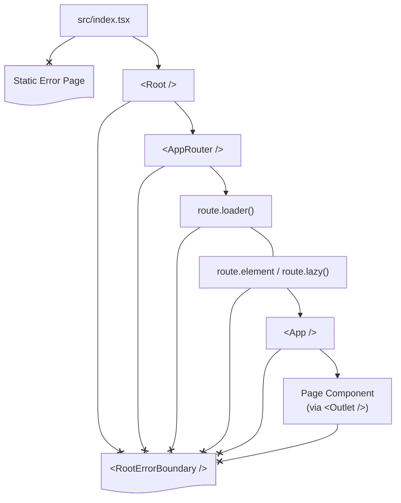

# RFC — Gestion des erreurs Frontend du portail PRO

> [!NOTE]
> Ce document a été construit et rédigé avec l'assistance de l'IA.

<!-- Run `npx doctoc path/to/file.md` to update it -->
<!-- START doctoc generated TOC please keep comment here to allow auto update -->
<!-- DON'T EDIT THIS SECTION, INSTEAD RE-RUN doctoc TO UPDATE -->
**Table of Contents**  *generated with [DocToc](https://github.com/thlorenz/doctoc)*

- [Vocabulaire](#vocabulaire)
- [Codes HTTP côté Frontend](#codes-http-c%C3%B4t%C3%A9-frontend)
- [Règles transversales](#r%C3%A8gles-transversales)
  - [Hiérarchie des Error Boundaries](#hi%C3%A9rarchie-des-error-boundaries)
  - [Contextualisation des messages d'erreur](#contextualisation-des-messages-derreur)
  - [Politique de retry sur erreur transitoire](#politique-de-retry-sur-erreur-transitoire)
  - [Politique de logging Sentry](#politique-de-logging-sentry)
- [D'un point de vue utilisateur (UX)](#dun-point-de-vue-utilisateur-ux)
  - [Quand une erreur peut-elle arriver d'un point de vue utilisateur ?](#quand-une-erreur-peut-elle-arriver-dun-point-de-vue-utilisateur-)
  - [Que devrait voir l'utilisateur lorsqu'une erreur arrive ?](#que-devrait-voir-lutilisateur-lorsquune-erreur-arrive-)
    - [Pendant le chargement de l'application](#pendant-le-chargement-de-lapplication)
    - [Pendant le premier chargement des données d'une page](#pendant-le-premier-chargement-des-donn%C3%A9es-dune-page)
    - [Pendant une mise-à-jour des données](#pendant-une-mise-%C3%A0-jour-des-donn%C3%A9es)
    - [Pendant une modification des données](#pendant-une-modification-des-donn%C3%A9es)
    - [Pendant une action UI](#pendant-une-action-ui)
    - [Pendant une récupération de ressource externe](#pendant-une-r%C3%A9cup%C3%A9ration-de-ressource-externe)
    - [Pendant une validation de données d'entrée](#pendant-une-validation-de-donn%C3%A9es-dentr%C3%A9e)
- [D'un point de vue technique](#dun-point-de-vue-technique)
  - [Comment devrait réagir l'application lorsqu'une erreur arrive ?](#comment-devrait-r%C3%A9agir-lapplication-lorsquune-erreur-arrive-)
    - [Pendant le chargement de l'application](#pendant-le-chargement-de-lapplication-1)
      - [Erreur inattendue](#erreur-inattendue)
      - [Erreurs gérées](#erreurs-g%C3%A9r%C3%A9es)
    - [Pendant le premier chargement des données d'une page](#pendant-le-premier-chargement-des-donn%C3%A9es-dune-page-1)
      - [Erreur inattendue](#erreur-inattendue-1)
      - [Erreurs gérées](#erreurs-g%C3%A9r%C3%A9es-1)
    - [Pendant une mise-à-jour des données](#pendant-une-mise-%C3%A0-jour-des-donn%C3%A9es-1)
      - [Erreur inattendue](#erreur-inattendue-2)
      - [Erreurs gérées](#erreurs-g%C3%A9r%C3%A9es-2)
    - [Pendant une modification des données](#pendant-une-modification-des-donn%C3%A9es-1)
      - [Erreur inattendue](#erreur-inattendue-3)
      - [Erreurs gérées](#erreurs-g%C3%A9r%C3%A9es-3)
    - [Pendant une action UI](#pendant-une-action-ui-1)
      - [Erreur inattendue](#erreur-inattendue-4)
      - [Erreurs gérées](#erreurs-g%C3%A9r%C3%A9es-4)
    - [Pendant une récupération de ressource externe](#pendant-une-r%C3%A9cup%C3%A9ration-de-ressource-externe-1)
      - [Erreur inattendue](#erreur-inattendue-5)
      - [Erreurs gérées](#erreurs-g%C3%A9r%C3%A9es-5)
    - [Pendant une validation de données d'entrée](#pendant-une-validation-de-donn%C3%A9es-dentr%C3%A9e-1)
      - [Erreur inattendue](#erreur-inattendue-6)
      - [Erreurs gérées — validation côté client](#erreurs-g%C3%A9r%C3%A9es--validation-c%C3%B4t%C3%A9-client)
      - [Erreurs gérées — validation côté serveur (422)](#erreurs-g%C3%A9r%C3%A9es--validation-c%C3%B4t%C3%A9-serveur-422)

<!-- END doctoc generated TOC please keep comment here to allow auto update -->

## Vocabulaire

- **Erreur inattendue** : Une erreur qui ne devrait jamais arriver et qui est déclenchée :
  - Soit volontairement dans le code via une assertion (condition + throw) sur un cas conceptuellement impossible.  
    _Exemple : une fois qu'on est dans au sein d'un composant de page de l'espace parnetaire, `rootStore.user.selectedPartnerVenue` ne peut conceptuellement pas être indéfini même si son type le permet._
  - Soit involontairement.
- **Erreur gérée** : Une erreur (plus ou moins) précise que l'on imagine possible et décide donc de gérer spécifiquement.  
  _Exemple : Une réponse 422 de l'API que l'on va traduire erreurs de formulaire ou un une réponse 404 suite à une action utilisateur qu'on va afficher comme échouée._
- **Atterrissage** : L'effet que provoque une erreur et qui inclut deux conséquences :
  - Le point de chute où une erreur est considérée comme traîtée (pile d'exécuton, valeur de résolution, log).
  - La réaction UX à cette erreur, qui peut être silencieuse ou non selon le cas d'erreur.

> [!NOTE]
> Cela veut dire qu'une **erreur inattendue** d'un point de vue Backend peut devenir une **erreur gérée** d'un point de vue Frontend.  
> _Il est par exemple normal de s'attendre à ce que tout appel API puisse répondre en 4XX ou 5XX, peut importe si elle est inattendue dans le Backend ou non._

## Codes HTTP côté Frontend

Pour des raisons de sécurité, le Backend transforme la majorité de ses erreurs en **404** afin de ne pas révéler l'existence de ressources protégées ou de failles potentielles. Cela signifie qu'un 404 reçu côté Frontend peut tout aussi bien signifier "la ressource n'existe pas" ou "le serveur a rencontré une erreur 500".

Les exceptions conservées (codes auxquels le Frontend peut faire confiance pour leur sens réel) sont :

- **401 Unauthorized** : L'utilisateur n'est pas authentifié (ou plus). Géré globalement par les intercepteurs HTTP.
- **403 Forbidden** : L'utilisateur est authentifié mais n'a pas les droits pour cette ressource ou cette action.
- **422 Unprocessable Entity** : Erreur de validation des données envoyées (utilisé sur les mutations, pas sur les GET).

**Cas particulier — 503 Service Unavailable** : Ce code peut provenir de deux sources distinctes :

- Une **maintenance volontaire** déclenchée côté Backend.
- Un **timeout ou une indisponibilité de l'infrastructure** (Google Cloud, etc.) qui peut survenir ponctuellement pendant l'utilisation normale.

Dans les deux cas, le Frontend redirige l'utilisateur vers la **page d'erreur statique HTML** (cf. Règles transversales → Page d'erreur statique HTML).

> [!IMPORTANT]
> Conséquence pour le Frontend : tous les codes hors 401, 403, 422 et 503 doivent être traités comme des erreurs génériques de chargement ou de modification, sans interprétation sémantique du code lui-même.

> [!NOTE]
> Le maintien des **403** distinctes des 404 est encore à valider côté Backend. Si elles sont à terme également masquées en 404, les comportements spécifiques aux 403 dans ce document devront être retirés.

## Règles transversales

Cette section liste les règles qui s'appliquent à toutes les phases d'erreur, indépendamment du moment où l'erreur survient.

### Hiérarchie des Error Boundaries

L'objectif est de contenir les crashes JS au niveau le plus local possible afin de ne jamais détruire le contexte de travail de l'utilisateur sans nécessité.

Trois niveaux d'Error Boundary sont prévus :

1. **`<ComponentErrorBoundary />`** : Wrappe les composants (cartes, sections, listes, etc.) qui peuvent échouer indépendamment du reste de la page. Affiche un état d'erreur local à l'emplacement du composant, le reste de la page restant fonctionnel.
2. **`<PageErrorBoundary />`** : Wrappe le contenu principal d'une page (`<main>`) pour contenir un crash dans la logique de la page elle-même. Affiche le titre de la page suivi d'un callout d'erreur, le layout restant fonctionnel (menu, tabs).
3. **`<RootErrorBoundary />`** : Filet de sécurité ultime si un crash remonte jusqu'à la racine. Affiche une page d'erreur globale.

> [!NOTE]
> Aujourd'hui, seul le niveau 3 (`<RootErrorBoundary />`) existe. Les niveaux 1 et 2 sont à mettre en place comme refacto. En attendant, tout crash JS non rattrapé tombe sur le `<RootErrorBoundary />`, ce qui est radical et destructif pour l'expérience utilisateur.

### Contextualisation des messages d'erreur

Un message d'erreur destiné à l'utilisateur ne doit jamais être un message générique du type "Une erreur est survenue". Il doit toujours préciser :

- **Quelle action ou quelle donnée est concernée** (ex: "Le rafraîchissement de la liste des offres a échoué").
- **Le déclencheur si pertinent** (ex: "lors de l'application du filtre 'Réservations actives'").

Cette précision est critique en contexte B2B où l'utilisateur a besoin de comprendre l'impact exact de l'erreur sur son flux de travail.

### Politique de retry sur erreur transitoire

Le Frontend ne doit ni retenter indéfiniment ni retenter trop fréquemment :

- **1 seul retry automatique** par erreur.
- **Attente de 1 minute** avant le retry automatique.
- Au-delà, l'utilisateur doit déclencher manuellement une nouvelle tentative (refresh, action, navigation).

Cette politique vaut pour les revalidations SWR automatiques, les chargements de chunks et toute autre récupération de données potentiellement transitoire.

### Politique de logging Sentry

- **À logger** : les erreurs hors codes HTTP "métier" (401, 403, 404, 422), c'est-à-dire les 5XX, les erreurs réseau, les crashes JS, et toutes les erreurs inattendues.
- **À ne pas logger** : les 401 (déjà gérées globalement), 403 (cas métier de droits), 404 (cas métier de ressource ou code masqué), 422 (validation utilisateur).

Cette politique évite de polluer Sentry avec du bruit "fonctionnel" tout en gardant la visibilité sur les vrais problèmes techniques.

### Page d'erreur statique HTML

La page d'erreur statique HTML est hostée par l'infrastructure **hors bundle React**, à l'URL définie par la constante `STATIC_ERROR_PAGE_URL` (anciennement `URL_FOR_MAINTENANCE`). Elle reste disponible même quand le bundle React ne peut pas être rendu.

C'est le **fallback ultime** pour tous les cas où le Frontend ne peut ni rendre l'application, ni afficher une Error Boundary :

- Crash pendant l'init de `index.tsx` (Sentry, Hotjar, orejime, `createRoot()`, etc.)
- Échec persistant de `vite:preloadError` après épuisement du compteur
- Réponse 503 sur un call critique au chargement de l'application

**Observabilité** : avant tout redirect vers cette page, un `Sentry.captureException(error)` enrichi d'un tag qualifiant la cause (ex: `cause: 'maintenance' | 'bundle-error' | 'preload-error'`) doit être suivi d'un `Sentry.flush(timeout)` **synchrone** (on attend effectivement la résolution de la promesse avant `window.location.assign(...)`). C'est **le seul mécanisme de tracking autorisé** : chaque atterrissage sur la page statique est un événement Sentry. Aucun signal véhiculé par l'URL ne doit être utilisé pour compter ou catégoriser les erreurs côté monitoring, car un query param est hackable par n'importe qui.

**Message utilisateur** : la page statique affiche un **message générique unique** ("Une erreur temporaire empêche de charger pass Culture Pro. Veuillez réessayer dans quelques minutes." ou équivalent) qui couvre les trois cas sans distinction. L'action attendue de l'utilisateur est identique dans tous les cas ; distinguer les causes à l'écran n'apporte pas de valeur et imposerait une coordination inutile avec l'équipe infra.

> [!NOTE]
> Le copy actuel de la page statique côté infra parle uniquement de "maintenance". Il doit être reformulé une seule fois par l'équipe infra pour couvrir l'ensemble des cas d'erreur (maintenance volontaire, erreur technique, problème de chargement). Coordination nécessaire, mais ponctuelle.

## D'un point de vue utilisateur (UX)

### Quand une erreur peut-elle arriver d'un point de vue utilisateur ?

- Pendant le chargement de l'application (= avant que la composant de page soit chargé et rendu).
- Pendant le premier chargement des données d'une page
- Pendant une mise-à-jour des données que contient une page (automatiquement ou suite à une action utilisateur).
- Pendant une modification des données suite à une action utilisateur (appel API, modification locale, etc).
- Pendant une action UI (ouverture d'un menu, étape suivante, etc).
- Pendant une récupération de ressource externe (téléchargement, export, opérations réseau secondaires).
- Pendant une validation de données entrées par l'utilisateur (formulaire, etc).

### Que devrait voir l'utilisateur lorsqu'une erreur arrive ?

#### Pendant le chargement de l'application

- **Erreur inattendue** : Une page d'erreur.
- **Erreur gérée** :
  - Maintenance (503 API) : Page d'erreur statique HTML (cf. Règles transversales → Page d'erreur statique HTML).
  - Token d'autologin invalide (paramètre URL) : Redirection vers la page de connexion avec un toast d'erreur.
  - Échec du chargement de l'identité utilisateur : Une page d'erreur indiquant que l'application n'a pas pu démarrer.
  - Échec du chargement d'une route au démarrage (loader, code dynamique) : Une page d'erreur indiquant que la page demandée n'a pas pu être chargée.
  - Échec d'un service non-critique au démarrage (feature flags, etc.) : L'application démarre normalement, sans message à l'utilisateur.

#### Pendant le premier chargement des données d'une page

- **Erreur inattendue** : Une page d'erreur.
- **Erreur gérée** :
  - Échec du chargement d'une ou plusieurs données principales : Le layout reste fonctionnel ; le contenu principal de la page affiche le titre suivi d'un callout d'erreur. Si le titre dépend d'une donnée non chargée, il est complété par un placeholder "_Erreur de chargement_" en lieu et place de la valeur attendue.
  - Échec du chargement d'une ou plusieurs données secondaires : Message d'erreur à l'emplacement de chacune des données concernées, le reste de la page restant fonctionnel.
  - Accès refusé (403) sur une donnée principale : Redirection silencieuse vers la page par défaut de l'utilisateur connecté.
  - Accès refusé (403) sur une donnée secondaire : Message d'erreur à l'emplacement de cette donnée signalant la perte d'accès, le reste de la page restant fonctionnel.
  - Donnée secondaire dont l'absence rend une partie de l'UI inutilisable (ex: liste de choix nécessaire à l'édition) : (Question ouverte : faut-il la traiter comme une donnée principale puisque son absence rend la page partiellement inopérante ?)

#### Pendant une mise-à-jour des données

- **Erreur inattendue** : Un toast d'erreur contextualisé indiquant les données dont le rafraîchissement a échoué.
- **Erreur gérée** :
  - Mise à jour déclenchée par un changement de filtres : Toast d'erreur mentionnant les données concernées et, si pertinent, le filtre appliqué.
  - Mise à jour déclenchée par un changement de page (pagination) : Toast d'erreur mentionnant les données concernées et la page demandée.
  - Mise à jour déclenchée par un changement d'ordre (tri) : Toast d'erreur mentionnant les données concernées et l'ordre demandé.
  - Mise à jour déclenchée par un bouton de rafraîchissement explicite : Toast d'erreur mentionnant les données concernées.
  - Mise à jour automatique en background (revalidation au focus, polling, reconnexion réseau, etc.) : Toast d'erreur mentionnant les données concernées.
  - Mise à jour en cascade après une modification réussie : Le toast de succès de la modification est conservé ; un toast d'erreur additionnel signale que les données affichées peuvent être périmées.
  - Accès refusé (403) sur une mise à jour : Toast d'erreur signalant la perte d'accès aux données concernées. Les anciennes données restent affichées (pas de redirection ni de purge).

#### Pendant une modification des données

- **Erreur inattendue** : Un toast d'erreur contextualisé indiquant l'action qui a échoué. L'état précédent est conservé.
- **Erreur gérée** :
  - Création d'une ressource (via formulaire ou action directe) : Toast d'erreur précis ; les valeurs saisies sont conservées dans le formulaire ; pour un formulaire multi-étapes, l'utilisateur revient à l'étape qui a généré l'erreur.
  - Édition d'une ressource (via formulaire ou action directe) : Toast d'erreur précis ; les valeurs saisies sont conservées dans le formulaire ; pour un formulaire multi-étapes, l'utilisateur revient à l'étape qui a généré l'erreur. La ressource conserve son état précédent.
  - Suppression d'une ressource : Toast d'erreur précis. La ressource reste affichée dans son état précédent. La modale de confirmation n'est pas réaffichée.
  - Action de bascule d'état (publication, validation, activation, etc.) : Toast d'erreur précis. L'état précédent est conservé.
  - Action en lot sur plusieurs ressources : Toast d'erreur unique récapitulant le nombre d'échecs (ex: "3 désactivations sur 10 ont échoué"). Les ressources qui ont réussi conservent leur nouvel état, celles qui ont échoué conservent leur état précédent.
  - Workflow déclenchant plusieurs mutations en cascade : Toast d'erreur précisant à quelle étape l'échec est survenu. Les mutations précédemment réussies ne sont pas annulées ; l'utilisateur peut reprendre le workflow à partir de l'étape échouée.
  - Accès refusé (403) sur une mutation : Toast d'erreur "Vous n'avez pas les droits pour effectuer cette action". L'état précédent est conservé.
  - Erreur de validation des données envoyées (422) : Voir la section "Pendant une validation de données d'entrée".

#### Pendant une action UI

- **Erreur inattendue** : Un toast d'erreur contextualisé indiquant l'action qui a échoué.
- **Erreur gérée** :
  - Échec d'une API navigateur native (clipboard, fullscreen, share, ouverture d'une nouvelle fenêtre bloquée, etc.) : Toast d'erreur précis indiquant l'opération concernée.

#### Pendant une récupération de ressource externe

Cette phase couvre les opérations qui déclenchent un appel réseau sans modifier les données affichées dans l'UI : téléchargement de fichier, export, génération de rapport, ainsi que les opérations réseau secondaires comme le tracking et l'analytics. Les opérations sont classées en deux catégories : **visibles** (l'utilisateur attend un retour) et **silencieuses** (l'utilisateur ignore leur existence).

- **Erreur inattendue** : Un toast d'erreur indiquant la ressource ou l'opération qui a échoué (uniquement pour les opérations visibles).
- **Erreur gérée** :
  - Téléchargement de fichier (justificatif, document, etc.) : Toast d'erreur précis indiquant le fichier concerné.
  - Export de données (CSV, XLSX, etc.) : Toast d'erreur précis indiquant l'export concerné.
  - Génération d'un rapport : Toast d'erreur précis indiquant le rapport concerné.
  - Logging d'événement analytics, tracking de navigation et autres opérations silencieuses : Aucun retour utilisateur. L'erreur est ignorée du point de vue de l'utilisateur.
  - Accès refusé (403) sur une récupération visible : Toast d'erreur "Vous n'avez pas les droits pour accéder à cette ressource".
  - Accès refusé (403) sur une opération silencieuse : Aucun retour utilisateur.

#### Pendant une validation de données d'entrée

Cette phase couvre la validation des données saisies par l'utilisateur, qu'elle soit déclenchée côté client (lors de la saisie ou de la soumission d'un formulaire) ou côté serveur (en réponse à une mutation, via un code 422). Elle s'applique à tous les inputs, qu'ils fassent partie d'un formulaire ou non.

- **Erreur inattendue** : Un toast d'erreur indiquant que la validation a échoué. Les données saisies par l'utilisateur sont conservées afin qu'il puisse les copier, les corriger, ou les transmettre au support.
- **Erreur gérée — validation côté client** :
  - Validation d'un champ unitaire (à la frappe, au blur, etc.) : Affichage du message d'erreur sous le champ concerné. Le moment exact du déclenchement (à la frappe, au blur, à la soumission) est laissé à la discrétion de chaque feature.
  - Validation à la soumission d'un formulaire : Le formulaire n'est pas soumis ; les messages d'erreur s'affichent sous les champs concernés. Pour un formulaire multi-étapes, l'utilisateur reste sur l'étape qui contient l'erreur.
  - Validation conditionnelle entre plusieurs champs (ex: champ requis si un autre est rempli) : Même comportement que la validation à la soumission.
- **Erreur gérée — validation côté serveur (422)** :
  - 422 avec erreurs par champ : Chaque erreur est mappée vers le champ concerné dans le formulaire ; un toast récapitulatif signale que le formulaire contient des erreurs.
  - 422 avec erreur globale (sans champ ciblé) : Toast d'erreur précis avec le message renvoyé par le serveur.
  - 422 avec erreurs imbriquées (champs imbriqués, listes) : Mapping vers les champs ou groupes de champs concernés ; toast récapitulatif.
  - 422 sur un formulaire multi-étapes : L'utilisateur revient à l'étape qui contient le ou les champs en erreur (cohérent avec la phase "Pendant une modification des données").

## D'un point de vue technique

### Comment devrait réagir l'application lorsqu'une erreur arrive ?

#### Pendant le chargement de l'application

##### Erreur inattendue

> [!NOTE]
> Ce diagramme illustre la chaîne d'Error Boundaries et sera réutilisé comme référence dans les phases suivantes.

Atterrissages techniques :

- **Crash dans `index.tsx`** (init Sentry, Hotjar, orejime, `createRoot()`, etc.) : Try/catch global qui capture l'exception via `Sentry.captureException(error, { tags: { cause: 'bundle-error' } })` suivi d'un `Sentry.flush()` synchrone, puis redirige vers la page d'erreur statique HTML. Cf. Règles transversales → Page d'erreur statique HTML.
- **Crash dans `<Root>`, `<AppRouter>`, `<App>`** : Capté par `<RootErrorBoundary />`.
- **Crash dans `route.loader()` ou `route.lazy()`** : Capté par `<RootErrorBoundary />`.
- **Log** : Sentry + Console.

> [!NOTE]
> Les `route.loader()` et `route.lazy()` peuvent s'exécuter à un changement de route alors que l'application est déjà techniquement chargée. Leur échec est néanmoins traité comme une erreur de chargement de l'application, avec le même atterrissage.

##### Erreurs gérées

- **503 sur n'importe quel call critique** : Redirection vers la page d'erreur statique HTML via le custom fetch (`clientConfig.ts`). Comportement déjà en place, mais à compléter par un `Sentry.captureException(error, { tags: { cause: 'maintenance' } })` et un `Sentry.flush()` synchrone avant `window.location.assign(...)` (cf. Règles transversales → Page d'erreur statique HTML).
- **Préchargement de chunk Vite échoué (`vite:preloadError`)** : Reload automatique unique avec compteur en `sessionStorage` ; en cas d'échec persistant, fallback sur `<RootErrorBoundary />`.
- **401 sur `/users/current`** (route whitelistée par le custom fetch) : Considéré comme non-connecté. Si l'utilisateur tente d'accéder à une route privée, redirection via React Router vers `/connexion`. Aucun message utilisateur (fonctionnement normal).
- **Token d'autologin invalide (paramètre URL)** : Redirection via React Router vers `/connexion` avec dispatch d'un snackbar d'erreur via `snackBarSlice`.
- **5XX ou network error sur le chargement du current user** : `<RootErrorBoundary />` avec message "Impossible de démarrer l'application". Log Sentry.
- **5XX ou network error sur le chargement des feature flags** : Démarrage en mode dégradé avec les valeurs par défaut existantes dans le code. Log Sentry technique uniquement (silencieux pour l'utilisateur).
- **5XX ou network error dans un `route.loader()`** : `<RootErrorBoundary />` via le mécanisme natif de React Router. Log Sentry.

> [!NOTE]
> Refactos techniques à prévoir pour respecter cette section :
> - Le current user et les feature flags sont aujourd'hui chargés via des hooks (`useUser`, `useLoadFeatureFlags`) qui ne bloquent pas le rendu de la page. Ils devraient à terme être chargés via le `route.loader()` du root (ou équivalent bloquant).
> - La fonction `logout()` (`commons/store/user/dispatchers/logout.ts`) effectue un hard refresh (`window.location.href`), ce qui détruit le store Redux. Pour permettre l'affichage de toasts via Redux après redirection (cas du token autologin invalide), elle devra avoir un second mode "navigation douce" via React Router.
> - Le `vite:preloadError` actuel (`index.tsx`) reload sans compteur. Il faudra ajouter une garde anti-boucle.
> - La page d'erreur statique HTML existe déjà côté infra (constante `URL_FOR_MAINTENANCE`) mais son usage est restreint au 503 API. À faire côté Frontend : (a) renommer `URL_FOR_MAINTENANCE` → `STATIC_ERROR_PAGE_URL` et la déplacer vers un helper dédié, (b) ajouter un try/catch global dans `index.tsx` qui redirige vers cette URL après capture Sentry, (c) ajouter la capture Sentry + flush synchrone sur tous les call sites de redirect existants. À faire côté infra : reformuler le copy de la page statique pour couvrir l'ensemble des cas d'erreur (pas seulement la maintenance volontaire). Ces deux pans peuvent avancer indépendamment.

#### Pendant le premier chargement des données d'une page

##### Erreur inattendue

- **Crash dans un composant enfant pendant le rendu initial** : Capté par `<ComponentErrorBoundary />` (cf. Règles transversales). État d'erreur local affiché à l'emplacement du composant.
- **Crash dans le composant de page lui-même pendant le rendu initial** : Capté par `<PageErrorBoundary />`. Le layout reste fonctionnel, le contenu principal affiche le titre suivi d'un callout d'erreur.
- **Crash qui remonte jusqu'à la racine** : Capté par `<RootErrorBoundary />` en dernier recours.
- **Log** : Sentry + Console.

##### Erreurs gérées

- **403 sur le chargement d'une donnée principale** : Redirection via React Router vers la page par défaut de l'utilisateur connecté (déterminée par son rôle et son contexte). Aucun message utilisateur.
- **403 sur le chargement d'une donnée secondaire** : Message d'erreur in-place à l'emplacement de la donnée signalant la perte d'accès. Le reste de la page n'est pas affecté.
- **Toute autre erreur sur le chargement d'une ou plusieurs données principales** (404, 5XX masqué, network error, etc.) : Le composant de page rend son layout normalement (titre + callout d'erreur dans le `<main>`), sans tenter de charger ni d'afficher les données dépendantes. Le titre utilise un placeholder "_Erreur de chargement_" si une partie de son texte dépend d'une donnée non chargée.
- **Toute autre erreur sur le chargement d'une ou plusieurs données secondaires** : Chaque composant qui consomme une donnée secondaire en échec affiche un message d'erreur à son emplacement habituel, le reste de la page n'étant pas affecté.
- **503** : Géré globalement par le custom fetch (cf. Phase 1).
- **Log** : Sentry pour les erreurs hors 401/403/404 (cf. Règles transversales).

> [!NOTE]
> La distinction "donnée principale / secondaire" est un concept métier, pas technique. Elle dépend du modèle affiché et du rôle de chaque donnée dans la page. À documenter feature par feature lors de l'implémentation.

> [!NOTE]
> Le traitement spécifique des 403 dépend de la décision Backend de conserver ou non ce code distinctement (cf. section "Codes HTTP côté Frontend"). Si les 403 sont à terme masquées en 404, ce comportement spécifique disparaîtra et toutes les erreurs hors 401/422/503 sur une donnée principale seront traitées de manière unifiée comme erreurs génériques de chargement.

#### Pendant une mise-à-jour des données

##### Erreur inattendue

- **Crash dans un composant pendant la mise à jour** : Capté par `<ComponentErrorBoundary />` (cf. Règles transversales). État d'erreur local affiché à l'emplacement du composant.
- **Crash dans le composant de page lui-même pendant un re-render** : Capté par `<PageErrorBoundary />`. Le layout reste fonctionnel, le contenu principal affiche le titre suivi d'un callout d'erreur.
- **Crash qui remonte jusqu'à la racine** : Capté par `<RootErrorBoundary />` en dernier recours.
- **Log** : Sentry + Console.

##### Erreurs gérées

- **Erreur sur une mise à jour déclenchée par l'utilisateur** (filtres, pagination, tri, bouton de rafraîchissement) : Toast d'erreur via `snackBarSlice` avec un message contextualisé indiquant les données concernées et le paramètre déclencheur si pertinent.
- **Erreur sur une revalidation automatique en background** (focus, polling, reconnexion réseau) : Toast d'erreur via `snackBarSlice` avec un message contextualisé indiquant les données concernées.
- **Erreur sur une revalidation en cascade après une mutation réussie** : Le toast de succès de la mutation est conservé ; un toast d'erreur additionnel est dispatché signalant que les données affichées peuvent être périmées.
- **403 sur une mise à jour** : Toast d'erreur via `snackBarSlice` signalant la perte d'accès aux données concernées. Les anciennes données affichées sont conservées (pas de purge ni de redirection).
- **503** : Géré globalement par le custom fetch (cf. Phase 1).
- **Log** : Sentry pour les erreurs hors 401/403/404 (cf. Règles transversales).

> [!WARNING]
> Le double affichage "toast de succès + toast d'erreur cascade" peut être perçu comme contradictoire ou anxiogène. Une alternative à considérer (à statuer avec le design) : un toast unique hybride du type "Modification enregistrée, mais l'affichage n'a pas pu être rafraîchi".

> [!NOTE]
> Pendant la mise à jour, l'UI doit afficher un état de loading sur les données concernées (spinner, skeleton ou indicateur visuel selon le contexte) avec un fallback sur les dernières données chargées avec succès si elles existent. Ce comportement est natif à SWR (`isValidating` couplé à `data` qui reste accessible pendant la revalidation).

#### Pendant une modification des données

##### Erreur inattendue

- **Crash dans un composant pendant la mutation ou le re-render après mutation** : Capté par `<ComponentErrorBoundary />` ou `<PageErrorBoundary />` selon le niveau (cf. Règles transversales).
- **Crash qui remonte jusqu'à la racine** : Capté par `<RootErrorBoundary />` en dernier recours.
- **Log** : Sentry + Console.

##### Erreurs gérées

- **Erreur sur une mutation simple** (création, édition, suppression, bascule d'état) : Toast d'erreur via `snackBarSlice` avec un message contextualisé indiquant l'action qui a échoué. L'état UI précédent est conservé. Pour un formulaire, les valeurs saisies sont conservées et, dans le cas d'un formulaire multi-étapes, l'utilisateur revient à l'étape qui a déclenché l'erreur.
- **Erreur sur une action en lot** : Le frontend agrège les résultats des mutations (idéalement via un endpoint batch backend) et affiche un toast unique récapitulant le nombre de réussites et d'échecs. Les ressources qui ont réussi conservent leur nouvel état, celles qui ont échoué conservent leur état précédent.
- **Erreur dans un workflow multi-mutations** : Approche "fail fast" — l'exécution s'arrête à la première erreur, un toast indique l'étape concernée, et l'utilisateur peut reprendre depuis cette étape. Les mutations précédentes ne sont pas annulées.
- **403 sur une mutation** : Toast d'erreur via `snackBarSlice` ("Vous n'avez pas les droits pour effectuer cette action"). L'état UI précédent est conservé.
- **422 sur une mutation** : Cas traité dans la section "Pendant une validation de données d'entrée".
- **503** : Géré globalement par le custom fetch (cf. Phase 1).
- **Log** : Sentry pour les erreurs hors 401/403/404/422 (cf. Règles transversales).

> [!WARNING]
> Pour les workflows multi-mutations, l'approche "fail fast" peut laisser des données partiellement créées (ex: une offre créée sans son stock associé, ou une image uploadée sans entité parente — l'upload de fichier rentre dans ce sous-cas). Cette situation doit être évitée par design (ne pas commencer un workflow qu'on ne peut pas garantir de compléter) ou par un mécanisme de cleanup côté backend. À documenter cas par cas.

> [!NOTE]
> Pour les actions en lot, privilégier un endpoint batch côté backend qui retourne un résultat agrégé (`succeeded` + `failed`). Si le backend ne propose pas d'endpoint batch, le frontend exécute les mutations en parallèle et agrège les résultats côté client.

#### Pendant une action UI

##### Erreur inattendue

- **Crash dans un composant déclenché par une action UI pure** (interaction sans appel réseau : ouverture de menu, navigation locale, manipulation de state local, etc.) : Capté par `<ComponentErrorBoundary />` ou `<PageErrorBoundary />` selon le niveau (cf. Règles transversales).
- **Crash qui remonte jusqu'à la racine** : Capté par `<RootErrorBoundary />` en dernier recours.
- **Log** : Sentry + Console.

##### Erreurs gérées

- **Échec d'une API navigateur native** (clipboard, fullscreen, share, ouverture d'une nouvelle fenêtre bloquée, etc.) : Toast d'erreur via `snackBarSlice` avec un message précis indiquant l'opération concernée.
- **Log** : Console uniquement.

> [!NOTE]
> Cette phase est volontairement minimaliste car la plupart des "actions utilisateur" déclenchent en réalité un appel réseau (mutation, chargement, téléchargement) et tombent dans les autres phases. Une "action UI" au sens strict est une interaction qui ne fait que manipuler l'état local de l'application ou utiliser une API navigateur native.

#### Pendant une récupération de ressource externe

##### Erreur inattendue

- **Crash dans un composant pendant la récupération** : Capté par `<ComponentErrorBoundary />` ou `<PageErrorBoundary />` selon le niveau (cf. Règles transversales).
- **Crash qui remonte jusqu'à la racine** : Capté par `<RootErrorBoundary />` en dernier recours.
- **Log** : Sentry + Console.

##### Erreurs gérées

- **Erreur sur un téléchargement de fichier visible** (justificatif, document, etc.) : Toast d'erreur via `snackBarSlice` avec un message contextualisé indiquant le fichier concerné.
- **Erreur sur un export visible** (CSV, XLSX, rapport, etc.) : Toast d'erreur via `snackBarSlice` avec un message contextualisé indiquant l'export concerné.
- **Erreur sur une opération silencieuse** (analytics, tracking, log d'événement) : Aucun retour utilisateur. Erreur ignorée silencieusement.
- **403 sur une récupération visible** : Toast d'erreur via `snackBarSlice` ("Vous n'avez pas les droits pour accéder à cette ressource").
- **403 sur une opération silencieuse** : Aucun retour utilisateur.
- **503** : Géré globalement par le custom fetch (cf. Phase 1).
- **Log** : Sentry pour les erreurs hors 401/403/404 sur les **opérations visibles** uniquement. Aucun log Sentry pour les opérations silencieuses afin d'éviter le bruit dans le monitoring.

> [!NOTE]
> Le prefetch et le preload sont volontairement hors scope. Ils ne nécessitent aucune gestion d'erreur spécifique : si un prefetch échoue, la donnée sera (re-)chargée naturellement quand l'utilisateur en aura besoin via une phase appropriée (Phase 2 ou 3).

#### Pendant une validation de données d'entrée

##### Erreur inattendue

- **Crash dans le validateur (Yup, validators custom)** : Capté à l'intérieur du gestionnaire de soumission via try/catch et traduit en toast d'erreur. Les données saisies sont conservées dans l'état du formulaire.
- **Crash dans la fonction de soumission elle-même** : Idem.
- **Crash dans un composant pendant l'affichage des erreurs** : Capté par `<ComponentErrorBoundary />` ou `<PageErrorBoundary />` selon le niveau (cf. Règles transversales).
- **Log** : Sentry + Console.

##### Erreurs gérées — validation côté client

- **Validation d'un champ unitaire** : Géré par React Hook Form (`formState.errors`). Le message d'erreur est affiché par le composant input lui-même, à proximité du champ.
- **Validation à la soumission** : Géré par React Hook Form via le resolver Yup. Si une ou plusieurs erreurs sont détectées, le `handleSubmit` ne déclenche pas la fonction de soumission métier. Les erreurs sont affichées sous les champs concernés.
- **Validation conditionnelle** : Géré par les schémas Yup avec `.when()` ou par des validators custom.
- **Log** : Aucun log Sentry (comportement attendu).

##### Erreurs gérées — validation côté serveur (422)

- **422 avec erreurs par champ** : Réponse parsée via `serializeApiErrors(error.body, form.setError)` qui mappe chaque clé du body vers le champ correspondant du formulaire. Un toast récapitulatif est dispatché via `snackBarSlice` ("Le formulaire contient des erreurs").
- **422 avec erreur globale** : Toast d'erreur via `snackBarSlice` avec le message renvoyé par le serveur.
- **422 avec erreurs imbriquées** : `serializeApiErrors` doit être étendu pour gérer les chemins imbriqués (`field.subfield`, `array.0.field`).
- **422 sur un formulaire multi-étapes** : Le composant gère la navigation vers l'étape contenant le premier champ en erreur, conformément à la phase "Pendant une modification des données".
- **Log** : Aucun log Sentry (comportement attendu).

> [!NOTE]
> Aujourd'hui, `serializeApiErrors` ne gère pas nativement les chemins imbriqués. C'est une limite technique qui devra être levée pour respecter cette section. À noter en refacto.

> [!NOTE]
> Question ouverte (à statuer avec le design) : pour les erreurs globales renvoyées par le serveur (422 avec un champ générique du type `global`), faut-il afficher uniquement un toast, ou aussi un placement spécifique dans le formulaire (par exemple un bandeau en haut, ou un message au-dessus du bouton de soumission) ?

---

Notes temporaires :
- La page d'erreur actuelle dépend du bon chargement de l'application, elle devrait peut-être être plus basique comme un fichier HTML alternative (si possible via SPA déployée sur Firebase). Ou on pourrait avoir les deux (une version statique et une version rendue via le router comme à l'heure actuelle). Je crois qu'on n'a pas de page d'erreur globale qui soit ErrorBoundary globale. Ça pourrait être une autre solution, ou une solution complémentaire.
- On devrait peut-être avoir des erreurs gérées qui soient nommées.
- Comment passer les erreurs d'un appel à l'appel parent ? Ca peut rapidement devenir compliqué en jonglant avec des erreurs inattendue qu'on pourrait vouloir rendre "gérée" plus haut pour en contrôler l'atterrissage.
- Anti-pattern à statuer : les `useEffect` qui chargent des données. Non couverts dans les sections par phase puisqu'on cherche à les éviter, mais ils existent dans le code. À traiter dans un encart dédié ou dans le document de stratégie technique.
- Promesses non-gérées dans des hooks (`unhandled promise rejection`) : sujet transversal qui mérite sa propre note ailleurs. Non captées par les Error Boundaries, et invisibles à l'utilisateur si aucun try/catch n'est en place.
- Détection technique "donnée principale / secondaire" : pas évidente côté code. Avec SWR, c'est au composant consommateur de décider, selon le rôle de la donnée dans la page. Pas besoin de marquage spécial dans le hook lui-même.
