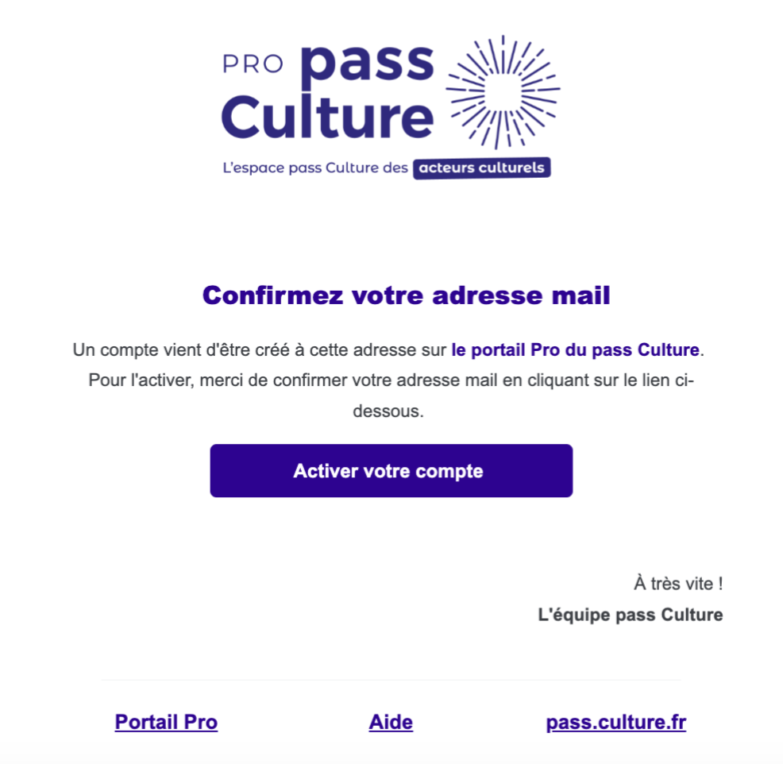

# Create test accounts

In order to test your integration before publishing it in production, we provide you with a test environment.
In this section, you will learn how to create an account on this test environment in **3 simple steps**.

:::warning
In the **test environment**, the account you are going to create will enable to log yourself as **a *cultural player* on the [PRO interface](https://integration.passculture.pro/connexion?de=%2F)** and to log yourself as **a *beneficiary* on the [app interface](https://integration.passculture.app/accueil)**.
:::

1. **Create an account** as a cultural player on the [integration test environment](https://integration.passculture.pro/inscription)

2. **Activate your account** by clicking on **"Activer mon compte"** button in the email you just received.

3. Now you can create [venues](https://aide.passculture.app/hc/fr/articles/4411992075281--Acteurs-Culturels-Comment-cr%C3%A9er-un-lieu-) and [offers linked to those venues](https://aide.passculture.app/hc/fr/articles/4412007248145).

