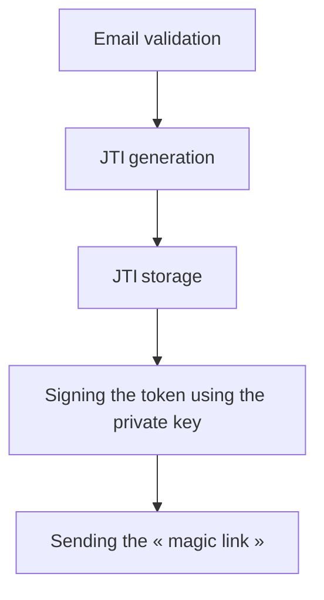
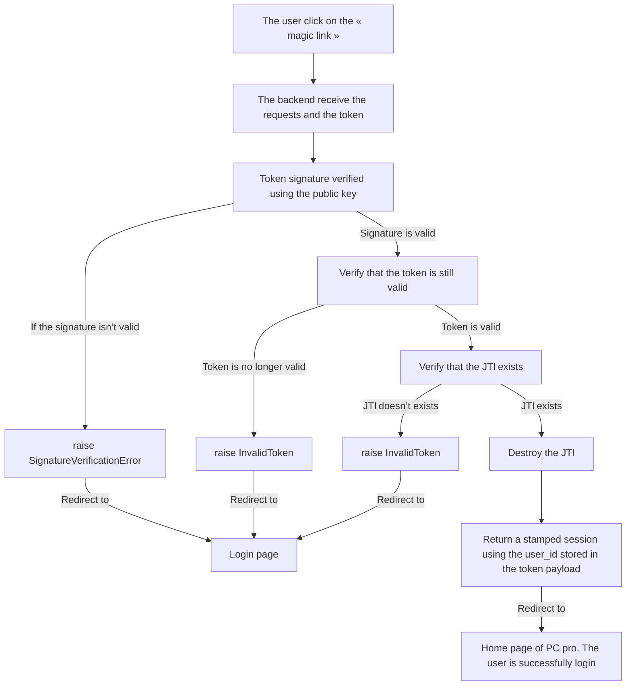

# Passwordless Login Token

In order to reduce the churn at the first login attempt, right after the inscription and the email validation, we decide to experiment with a passwordless login.
For this purpose, we built a technical specification around a « passwordless login token. » In exchange for this single-use token, a user should be returned a valid stamped session.

## Technical details

The token will be a JWT token containing the following [claims](https://datatracker.ietf.org/doc/html/rfc7519#page-9):

```

{

	"sub": [user_id],
	"iat": [issuedAtDate],
	"exp": [expirationDate],
	"jti": [JWT ID]

}

```

`sub` is the subject of the token, here the user, hence storing the user_id.

`jti` is the JWT unique identifier, stored for each JWT generation and destroyed every time a passwordless login token is consumed, hence preventing «replay attacks».

The token will be signed using an RSA 4096-bit private key, and the signature will be verified using the corresponding public key.

### Validation and generation algorithm 

- Generation process:



- Validation process:



The JTI is a UUID4, which is suitable for cryptographic uses.
It has also been decided, jointly with the SSI, that the time to live of the JTI of the token should be 8 hours.
At this time, and during the experimentation of the passwordless login feature, no other uses of the token implementation are allowed, nor an extension of the time-to-live value.

### Implementation usage

Two helpers are available under src.pcapi.core.token :
- create_passwordless_login_token
- validate_passwordless_token

`create_passwordless_login_token` takes two mandatory parameters: the user_id for which the token is about to be generated and the time to live of the associated JTI.
`validate_passwordless_token` takes the token as a unique parameter, performs all security checks, including destroying the JTI to prevent replay attacks, and returns the token payload, which can be trusted.


