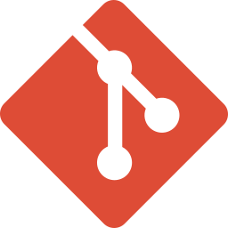

# 🚀 pass Culture PRO — App Front-End

Ce dossier `/pro` contient l’ensemble de la configuration et les sources de l'application Web du portail professionnel du pass Culture.

**Sommaire**

- [Pré-requis](#pré-requis)
  - [WSL 2 (Windows uniquement)](#--wsl-2-windows-uniquement)
  - [Git](#-git)
  - [Node.js (via nvm)](#-nodejs-via-nvm)
  - [Yarn](#-yarn)
  - [Docker](#-docker)
- [Installer le projet](#installer-le-projet)
  - [Lancer le front-end](#lancer-le-front-end)
  - [Sandbox](#sandbox)
- [Développer](#développer)
  - [Configurer son éditeur](#configurer-son-éditeur)
  - [Les tests](#les-tests)
  - [Storybook](#storybook)
  - [Adage](#adage)
  - [Standards de code et d’architecture](#standards-de-code-et-darchitecture)
  - [Dette technique](#dette-technique)
- [Annexes](#annexes)

---

# Pré-requis

##   WSL 2 (Windows uniquement)

Pour les utilisateurs de Windows, il est recommandé d'utiliser [WSL 2](https://learn.microsoft.com/en-us/windows/wsl/install) avec une distribution Linux (Ubuntu, par exemple) pour développer sur le projet.

> **[Installer WSL 2](https://learn.microsoft.com/fr-fr/windows/wsl/install)**

##  Git

> **[Installer Git](https://git-scm.com/downloads)**

Il est recommandé pour ce repository d’utiliser la configuration suivante :

```bash
# Configurer le nom de la branche par défaut
git config --global init.defaultBranch master

# Configurer le mode de pull par défaut à "rebase"
git config --global pull.rebase true
```

La convention des messages de commit suit la norme [Conventional Commits](https://www.conventionalcommits.org/).

Pour s’assurer que les messages de commit respectent cette convention, il est également conseillé d’installer **Commitizen** qui vous guidera dans la rédaction de messages de commit conformes à la convention.

> **[Installer Commitizen](https://commitizen-tools.github.io/commitizen/#installation)** (conseillé)

##  Node.js (via nvm)

Il est recommandé d'utiliser **nvm** pour installer et gérer la version de Node.js.

> **[Installer nvm](https://github.com/nvm-sh/nvm)**

Une fois nvm installé, on peut installer et utiliser la bonne version de Node.js :

```bash
nvm install 24.8

nvm use 24.8

# (Conseillé : pour utiliser la version 24.8 par défaut)
nvm alias default 24.8
```

##  Yarn

Afin d’uniformiser les outils utilisés, il est recommandé d’utiliser **Yarn**.

Actuellement, la version de Yarn utilisée sur le projet est la version dite « classic » `1.22.22`.

Avec Node.js 20, **pas besoin d'installer Yarn manuellement**, il suffit d'activer **corepack** :

```bash
corepack enable
```

Ceci permettra d'utiliser automatiquement la bonne version de Yarn sur le projet.

##  Docker

Bien qu’il soit possible d’installer le backend et tous les autres services de façon manuelle sur sa machine, il est conseillé d’utiliser Docker pour démarrer plus rapidement.

> **[Installer Docker Desktop](https://www.docker.com/products/docker-desktop/)**

---

# Installer le projet

Commencer par cloner le projet :

> Vous aurez besoin d’une clé SSH pour cloner le projet. Consultez [la documentation GitHub](https://docs.github.com/fr/authentication/connecting-to-github-with-ssh/adding-a-new-ssh-key-to-your-github-account) pour effectuer la procédure.

```bash
git clone git@github.com:pass-culture/pass-culture-main.git

cd pass-culture-main
```

La plupart des services backend sont gérés par des scripts automatisés, disponibles dans un script nommé `pc` (pour _pass culture_).

Afin d'avoir accès à ces scripts, il est conseillé de créer un lien symbolique vers le script `pc` à la racine du projet :

```bash
./pc symlink
```

Installez ensuite l’environnement local (nécessite que Docker Desktop soit lancé) :

```bash
pc install
```

Une fois l’environnement installé, démarrez le backend avec la commande suivante à la racine du projet :

```bash
pc start-backend

# ou si vous avez configuré le proxy :
pc start-proxy-backend

# ⚠️ Cela peut prendre plusieurs minutes …
```

Cela aura pour effet de builder et lancer les conteneurs Docker permettant de faire tourner les services nécessaires, notamment :

- l'API backend (réponds sur le port [:5001](http://localhost:5001))
- la base de données (réponds sur le port **:5434**)
- le back-office (réponds sur le port [:5002](http://localhost:5002))

> [!TIP]
>
> Si plus tard vous souhaitez redémarrer le back-end sans rebuilder les images Docker, vous pouvez utiliser le flag `--fast` :
>
> `pc start-backend --fast` ou `pc start-proxy-backend --fast`

## Lancer le front-end

Le front-end se trouve dans le sous-dossier `/pro`, dans lequel on retrouve la structure d’une application React.

Normalement, les dépendances ont déjà été installées avec le script `pc`, sinon on peut le faire manuellement avec `yarn install`.

Pour démarrer l’application front-end, il suffit de se placer dans le sous-dossier `/pro` et de lancer la commande `yarn start` :

```bash
cd pro

yarn start
```

Une fenêtre s’ouvre sur le port [:3001](http://localhost:3001) et affiche une page de connexion.

## Sandbox

Pour générer des données locales (comptes utilisateurs, structures, etc.), on peut utiliser le script `pc sandbox` :

```bash
pc sandbox -n industrial

# ⚠️ Peut prendre plusieurs minutes …
```

Une fois les données générées, on peut se connecter au portail pro avec un compte d'exemple comme :

- Adresse email : `retention_structures@example.com`
- Mot de passe : `user@AZERTY123`

---

# Développer

Conseils et recommandations pour développer sur le projet.

## Configurer son éditeur

L’éditeur de code recommandé est **VSCode**.

> **[Installer VSCode](https://code.visualstudio.com/)**

> [!TIP]
>
> Pour la partie Front-End, il est recommandé d’ouvrir le projet **directement à la racine du sous-dossier `/pro`**.

**Extensions recommandées :**

VSCode vous proposera d’installer automatiquement les extensions recommandées lorsque vous ouvrirez le projet dans /pro.

La liste est disponible dans le fichier [`.vscode/extensions.json`](https://github.com/pass-culture/pass-culture-main/blob/master/pro/.vscode/extensions.json).

## Les tests

**Tests unitaires / d’intégration :**

Les fichiers de tests sont disponibles à côté de chaque composant ou fichier TypeScript et se terminent par `.spec.ts(x)`.

Pour les lancer, on utilise la commande suivante :

```bash
yarn test:unit

# Lance "vitest" avec la bonne configuration
```

**Tests end-to-end :**

Nous utilisons **Playwright** pour Les tests E2E. Ils sont disponibles dans le sous-dossier `/pro/e2e`.

Plus d'informations sur les tests E2E [ici](./e2e/README.md)

## Storybook

Les composants d'interface de l'application Pro sont regroupés dans un **Storybook** accessible en ligne.

- 🔗 [Storybook en ligne](https://pass-culture.github.io/pass-culture-main/)

Il est aussi possible de lancer le Storybook localement avec la commande suivante :

```bash
yarn storybook

# Réponds sur le port :6006
```

## Adage

Nous intégrons une sous-route du portail Pro (`/adage-iframe/`) dans une iframe au sein d'ADAGE, la plateforme des établissements scolaires permettant de gérer leurs activités culturelles.

Il s’agit d’une application web pour les rédacteurs de projets scolaires, leur permettant de réserver des offres sur le pass Culture pour leurs élèves.

### Accès à l’iframe ADAGE

```bash
# Ouvrir la console bash
pc bash

# Générer un token
flask generate_fake_adage_token
```

Il suffit ensuite de suivre l’URL générée accéder à l’app

### Affichage d'offres en local

Comme le local est branché sur algolia de testing, les ids qui sont remontés d'algolia sont ceux de testing, et il n’est pas certain qu'on ait les mêmes en local.

Pour récupérer les ids de certaines offres en local, on peut utiliser un index local. Pour cela, il faut :

- Créer un nouvel index sur la sandbox algolia : `<votre_nom>-collective-offers`

- Créer un fichier `.env.development.local` dans le dossier `pro/src` et renseigner le nom de l’index dans la variable `VITE_ALGOLIA_COLLECTIVE_OFFERS_INDEX`

- Créer un fichier `.env.local.secret` dans le dossier `api` et renseigner les variables suivantes :

```
ALGOLIA_COLLECTIVE_OFFER_TEMPLATES_INDEX_NAME=<votre_nom>-collective-offers
ALGOLIA_TRIGGER_INDEXATION=1
ALGOLIA_API_KEY=<demander l’api key>
ALGOLIA_APPLICATION_ID=testingHXXTDUE7H0
SEARCH_BACKEND=pcapi.core.search.backends.algolia.AlgoliaBackend
```

- Ouvrir la console bash

```
pc bash
```

- Réindexer vos offres collectives

```
flask reindex_all_collective_offers
```

## Standards de code et d’architecture

La documentation est intégrée au projet, aux travers de fichiers README à la racine des dossiers principaux.

Vous trouverez une documentation générale ainsi que des liens vers les différents README en suivant ce lien :

- 🔗 [Standards de code et d'architecture](./src/README.md)

## Dette technique

Nous utilisons **SonarCloud** pour monitorer la dette technique.

- 🔗 [Lien vers le projet Portail Pro sur SonarCloud](https://sonarcloud.io/project/overview?id=pass-culture_pass-culture-main)

---

# Annexes

Vous retrouverez dans le fichier [`pro/package.json`](https://github.com/pass-culture/pass-culture-main/blob/master/pro/package.json) des scripts Yarn utiles pour le développement.

## Générer des templates de composants React et utilitaires avec [Templatron](https://www.npmjs.com/package/templatron) :

Lister les templates disponibles :

```bash
npx templatron --list
```

Créer un nouveau composant React :

```bash
npx templatron component MonNouveauComposant
```

Créer un fichier utilitaire (ex: fonction/classe JS) :

```bash
npx templatron util maFonction
```

> [!NOTE]
>
> Les fichiers de template sont consultables dans le [dossier `.templatron/`](./.templatron/)

Pour plus de détails sur le fonctionnement des templates, voir la [documentation de Templatron](https://github.com/jmpp/templatron).

## Linter les fichiers TypeScript :

```bash
yarn lint:js
```

## Identifier du code mort :

```bash
yarn lint:dead-code
```

## Identifier des problèmes de types TS :

```bash
yarn tsc -b
```
