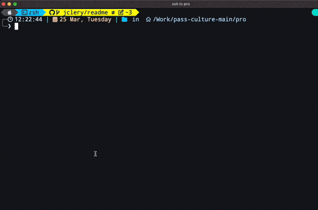

# Générateur de fichiers

Si vous avez besoin de créer de nouveaux composants React ou fichiers utilitaires qui respectent les normes de code et d'architecture du projet, vous pouvez utiliser ce script de génération.



**Sommaire**

- [Générer un composant React](#générer-un-composant-react)
- [Générer un fichier utilitaire](#générer-un-fichier-utilitaire)
- [(Bonus) Créer votre commande pour générer des fichiers ✨](#bonus-créer-votre-commande-pour-générer-des-fichiers)

# Générer un composant React

Générer un composant du nom de **MyComponent** :

```bash
yarn generate:component MyComponent
```

Cela va demander le dossier dans lequel le composant devra être créé :

```
? Target directory? (Use arrow keys or type to search)
❯ ./src
  src/apiClient
  src/apiClient/__specs__
  src/apiClient/adage
  src/apiClient/adage/core
  src/apiClient/adage/models
  src/apiClient/adage/services
(Move up and down to reveal more choices)
```

L'utilitaire demande ensuite s'il faut créer un sous-dossier pour accueillir les fichiers à générer :

```
? Create sub-directory /MyComponent/ ? (Y/n)
```

Vous pourrez ensuite choisir si vous souhaitez générer les fichiers pour le module SCSS, les tests et les stories :

```
✔ Generate SCSS module? (Use arrow keys)
❯ Yes
  No

✔ Generate test file? (Use arrow keys)
❯ Yes
  No

✔ Generate storybook file? (Use arrow keys)
❯ Yes
  No
```

À la fin, un résumé sera présenté avant confirmation définitive :

```
This will generate all these files:

/Users/jm-culture/Work/pass-culture-main/pro/src/components
└─ MyComponent
   ├─ MyComponent.tsx
   ├─ MyComponent.module.scss
   ├─ MyComponent.spec.tsx
   └─ MyComponent.stories.tsx

? Is that ok? (Y/n)
```

Si tout s'est bien passé, une confirmation des fichiers générés apparaît :

```
✅ Successfully generated files:

 - /Users/jm-culture/Work/pass-culture-main/pro/src/components/MyComponent/MyComponent.tsx
 - /Users/jm-culture/Work/pass-culture-main/pro/src/components/MyComponent/MyComponent.module.scss
 - /Users/jm-culture/Work/pass-culture-main/pro/src/components/MyComponent/MyComponent.spec.tsx
 - /Users/jm-culture/Work/pass-culture-main/pro/src/components/MyComponent/MyComponent.stories.tsx
```

# Générer un fichier utilitaire

Générer un utilitaire du nom de **myUtil** :

```bash
yarn generate:util myUtil
```

Cela va demander le dossier dans lequel le composant devra être créé :

```
? Target directory? (Use arrow keys or type to search)
❯ ./src
  src/apiClient
  src/apiClient/__specs__
  src/apiClient/adage
  src/apiClient/adage/core
  src/apiClient/adage/models
  src/apiClient/adage/services
(Move up and down to reveal more choices)
```

L'utilitaire demande ensuite s'il faut créer un sous-dossier pour accueillir les fichiers à générer :

```
? Create sub-directory /myUtil/ ? (Y/n)
```

Vous pourrez ensuite choisir si vous souhaitez générer le fichier de specs :

```
✔ Generate test file? (Use arrow keys)
❯ Yes
  No
```

À la fin, un résumé sera présenté avant confirmation définitive :

```
This will generate all these files:

/Users/jm-culture/Work/pass-culture-main/pro/src/utils
├─ myUtil.ts
└─ myUtil.spec.ts

✔ Is that ok? yes
```

Si tout s'est bien passé, une confirmation des fichiers générés apparaît :

```
✅ Successfully generated files:

 - /Users/jm-culture/Work/pass-culture-main/pro/src/utils/myUtil.ts
 - /Users/jm-culture/Work/pass-culture-main/pro/src/utils/myUtil.spec.ts
```

# (Bonus) Créer votre commande pour générer des fichiers

Il est tout à fait possible de créer vos propres commandes pour générer des fichiers à partir de modèles.

Les raccourcis de commande **yarn** doivent être renseignés dans **package.json** :

```json
{
  "scripts": {
    "generate:nouvelle_commande": "node ./scripts/generator/index.js --nouvelle_commande"
  }
}
```

La nouvelle commande devra être invoquée de la manière suivante :

```bash
yarn generate:nouvelle_commande <NOM_ELEMENT>
```

Ensuite, il faut créer un dossier **du même nom que la commande souhaitée** dans le dossier de templates `./scripts/generator/_templates`.

Le dossier doit être impérativement composé d'un fichier de configuration `config.js` et d'un ou plusieurs fichiers de modèles `.mustache`.

Exemple :

```
_templates
└─ nouvelle_commande
   ├─ config.js
   ├─ <% name %>.ts.mustache
   └─ <% name %>.spec.ts.mustache
```

> [!WARNING]
>
> Actuellement, les sous-dossiers de template ne sont pas encore gérés (work in progress)

Les noms des fichiers `.mustache` doivent inclure l'extension souhaitée (ts, js, tsx, …) et peuvent inclure la variable `<% name %>` qui sera remplacée par la valeur `<NOM_ELEMENT>` choisie à l'invocation de la commande.

## Fichier de configuration `config.js`

Le fichier `config.js` doit exporter par défaut un objet de configuration avec les propriétés suivantes :

```js
export default {
  templateFolderName: 'nouvelle_commande',

  filesToGenerate: [
    // 1st file will always be generated
    {
      templateFileName: '<% name %>.ts.mustache',
    },
    // Yes/No questions …
    {
      templateFileName: '<% name %>.spec.ts.mustache',
      question: 'Generate spec file?',
      varName: 'spec',
    },
    // …
  ],
}
```

- `templateFolderName` : le nom du dossier de template à utiliser
- `filesToGenerate` : un tableau de fichiers à générer

Le premier objet du tableau **sera toujours généré**, et ne doit contenir QUE la propriété `templateFileName`.

Les objets qui suivent seront générés si la question de confirmation est validée par l'utilisateur. La réponse à la question est stockée dans la propriété `varName` du fichier de configuration, afin d'être utilisée dans les templates `.mustache`.

## Fichiers de modèles `.mustache`

Les fichiers de modèles sont compilés avec [Mustache.js](https://github.com/janl/mustache.js).

Chaque fichier reçoit l'objet de view suivante :

```js
{
  name: "<NOM_ELEMENT>", //
  spec: { yes: true, no: false }, // En fonction de réponse de l'utilisateur
  // …
}
```

L'intérieur de chaque fichier `.mustache` peut ainsi lire la valeur de `name` et de `spec` pour choisir le code à générer :

```mustache
<%# spec.yes %>
// This will be present only if user answered "Yes" to the "spec" question
<%/ spec.yes %>

<#% spec.no %>
// This will be present only if user answered "No" to the "spec" question
<#/ spec.no %>

const <% name %> = "Hello World!"

// Rest of file to be generated …
```

Si l'utilisateur à invoqué la commande `yarn generate:nouvelle_commande message` et choisi "No" à la question "spec", alors le fichier généré sera :

```ts
// This will be present only if user answered "No" to the "spec" question

const message = 'Hello World!'

// Rest of file to be generated …
```
