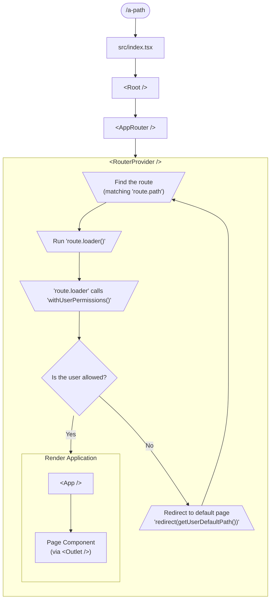
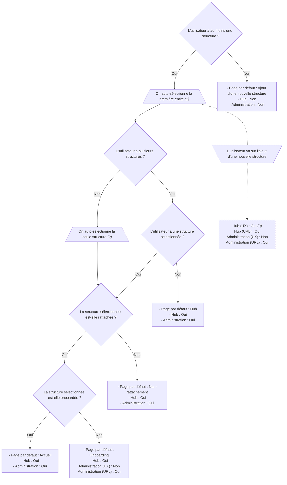

# App

<!-- Run `npx doctoc src/app/README.md` to update it -->
<!-- START doctoc generated TOC please keep comment here to allow auto update -->
<!-- DON'T EDIT THIS SECTION, INSTEAD RE-RUN doctoc TO UPDATE -->
**Table of Contents**  *generated with [DocToc](https://github.com/thlorenz/doctoc)*

- [Rendu d'une page](#rendu-dune-page)
- [Responsabilités](#responsabilit%C3%A9s)
- [Permissions](#permissions)
  - [Page par défaut et autorisation d'accès aux espaces](#page-par-d%C3%A9faut-et-autorisation-dacc%C3%A8s-aux-espaces)

<!-- END doctoc generated TOC please keep comment here to allow auto update -->

## Rendu d'une page

## Responsabilités

Dans la mesure du possible, chaque responsabilité globale ou transverse doit être gérée par **une et une seule fonction** (util, composant, hook, etc).

| Scope         | Rôle | Fonction |
| ------------- | ---- | -------- |
| User          | (Re-)Charger l'ensemble des entités et structures, ce qui (re-)sélectionne automatiquement la bonne entité et structure pour chaque espace. | `initializeUser()` |
| User          | Quelle est l'ID de l'entité à sélectionner pour l'espace d'administration selon l'état actuel de l'application ? | `getInitialAdminOffererId()` |
| User          | Quelle est l'ID de la structure à sélectionner pour l'espace partenaire selon l'état actuel de l'application ? | `getInitialPartnerVenueId()` |
| User          | Changer d'entité pour l'espace d'administration. | `setSelectedAdminOffererById()` |
| User          | Changer de structure pour l'espace partenaire. | `setSelectedPartnerVenueById()` |
| User          | Quelles sont les permissions de l'utilisateur ? | `getCurrentUserPermissions()` |
| Routing, User | Quel est le chemin de sa page par défault ? | `getUserDefaultPath()` |

## Permissions

Les permissions sont calculées à partir du state Redux par la fonction `getCurrentUserPermissions()`.

| Flag                               | Description métier                                                                                         |
| ---------------------------------- | ---------------------------------------------------------------------------------------------------------- |
| `isAuthenticated`                  | Est-il authentifié ?                                                                                       |
| `hasSelectedParnerVenue`           | A-t-il une structure séléctionnée (espace partenaire) ?                                                    |
| `isSelectedPartnerVenueAssociated` | La structure sélectionnée est-elle rattachée à ce compte (= le rattachement a-t-il été validé) ?           |
| `hasSelectedAdminOfferer`          | A-t-il un entité séléctionnée (espace d'administration) ?                                                  |
| `isSelectedAdminOffererAssociated` | L'entité sélectionnée est-elle rattachée à ce compte (= le rattachement a-t-il été validé) ?               |
| `isOnboarded`                      | Une offre a-t-elle déjà été créée sur une des structures de l'entité parenet à la structure sélectionnée ? |

### Page par défaut et autorisation d'accès aux espaces

Selon :
- les structures et entités auxquelles l'utilisateur a accès (valides et en attente de validation),
- son entité sélectionnée ou non pour son espace d'administration,
- sa structure sélectionnée ou non pour son espace partenaire,

ce schéma répond à ces questions :
- Quelle est sa page par défaut ?
- A-t-il le **droit** d'accéder au Hub ? (en entrant `/hub` dans sa barre d'adresse)
- A-t-il un bouton pour accéder au Hub sur sa page par défaut ?
- A-t-il le **droit** d'accéder à l'espace d'administration ? (en entrant `/administration` dans sa barre d'adresse)
- A-t-il un bouton pour accéder à l'espace d'administration sur sa page par défaut ?

> [!NOTE]  
> _(1) Première entité de la liste, ordonnée par nom, tout état confondu (= y compris en attente de rattachement)._  
> _(2) Première structure de la liste, ordonnée par nom, tout état confondu (= y compris en attente de rattachement)._  
> _(3) Seulement sur la première étape de l'ajout de structure, via un bouton "Annuler et quitter"._
