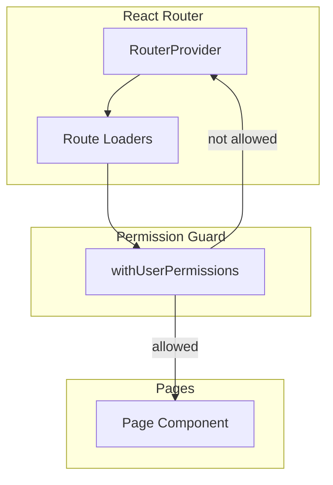
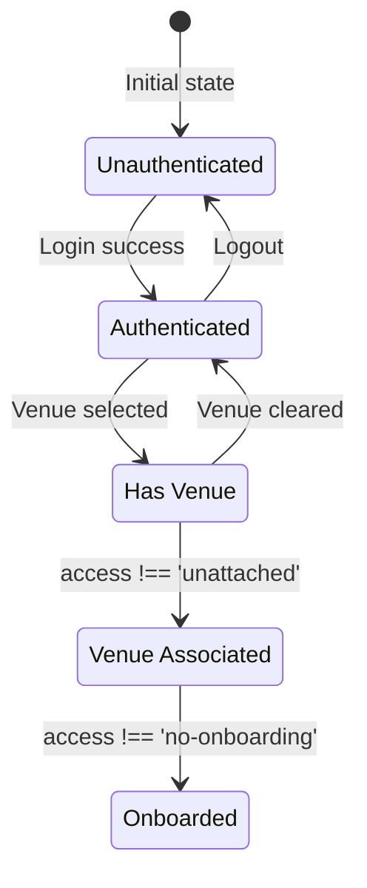
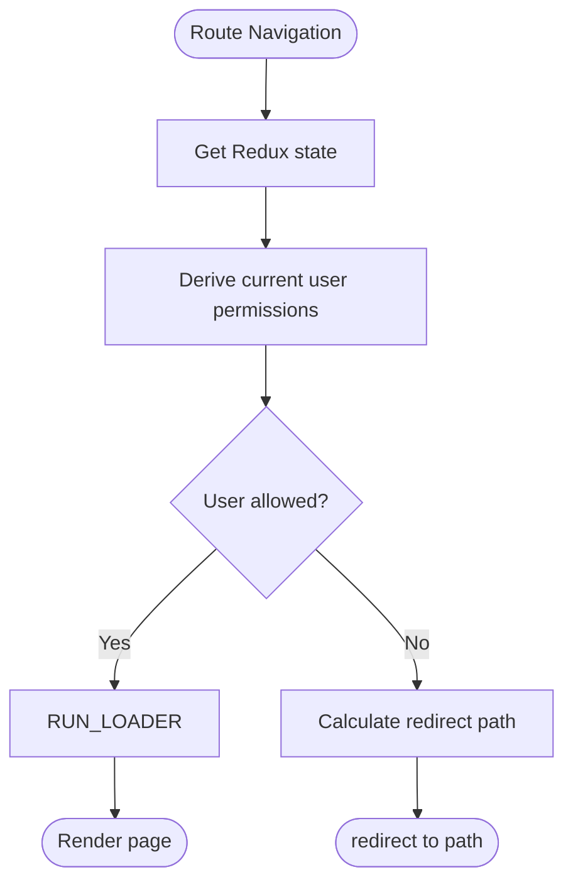
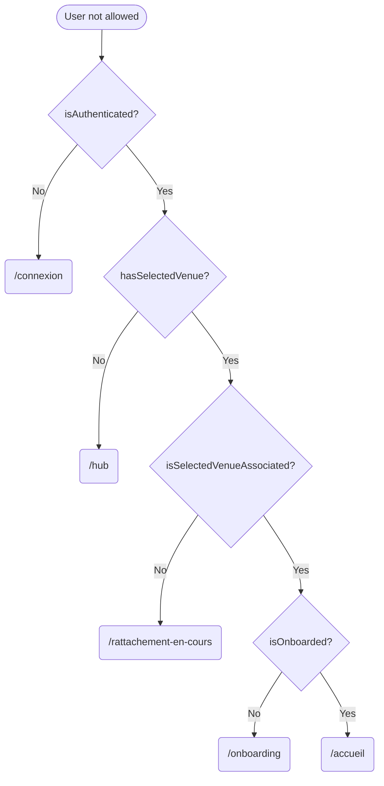
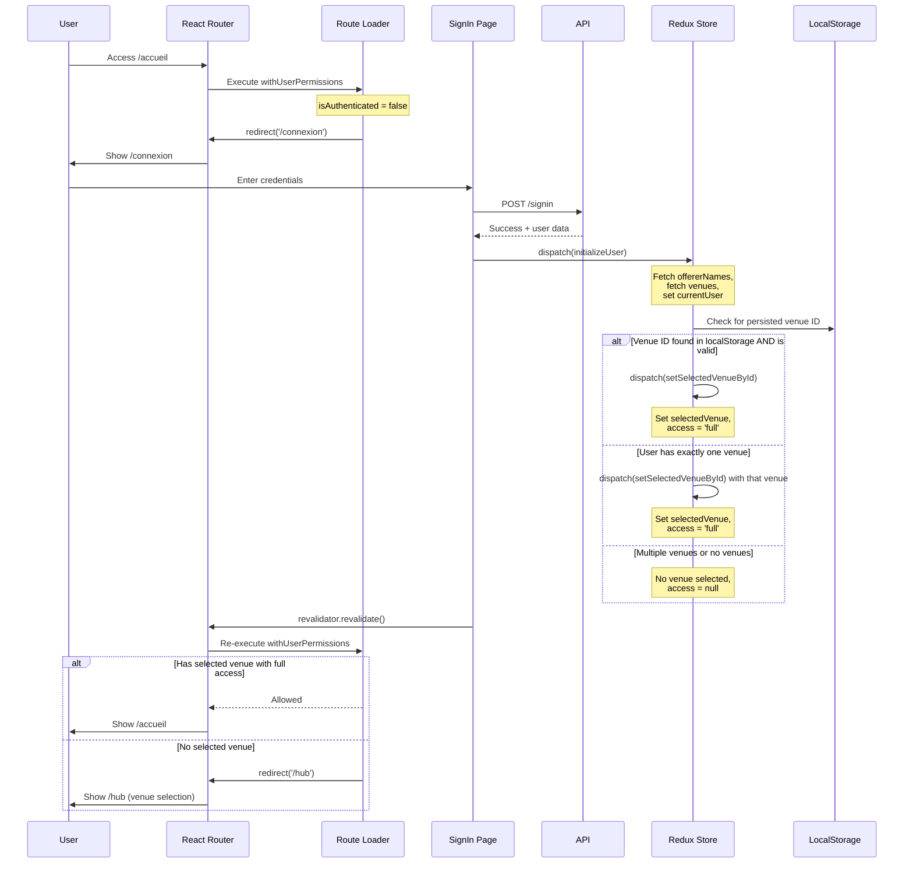

# Authentication & Routing System

This document describes the permission-based routing system under the `WIP_SWITCH_VENUE` feature flag.

---

- [Architecture Overview](#architecture-overview)
- [User Permissions](#user-permissions)
- [Loader-Based Permission Guard](#loader-based-permission-guard)
- [Redirect Priority Chain](#redirect-priority-chain)
- [Authentication Flow](#authentication-flow)
  - [With `WIP_SWITCH_VENUE` enabled](#with-wip_switch_venue-enabled)

---

## Architecture Overview

The system uses React Router's `loader` functions as middleware to enforce permissions before routes render. This approach:
- Runs permission checks before any component renders, avoiding the "flash" of unauthorized content (when a component briefly appears before the redirect kicks in).
- Handles redirects at the router level (not in React components).
- Makes permission requirements explicit on each route.
- Uses `revalidator.revalidate()` after state changes to trigger automatic re-evaluation.
- The `UserPermissions` object can later be generated by the Backend with minimal Frontend changes when authentication is refactored.
- Bonus 🎁:
  - After logging in, you just have to call revalidator.revalidate();
  - After selecting a venue, you just have to call navigate('/accueil');

  The loader automatically handles redirects to the appropriate intermediate page (hub, onboarding, unattached page, etc.), so you no longer need to worry about determining the correct redirect based on current permissions.



## User Permissions

| Flag                        | Business Description                                          |
| --------------------------- | ------------------------------------------------------------- |
| `isAuthenticated`           | Is the user authenticated?                                    |
| `hasSelectedVenue`          | Has the user selected a venue?                                |
| `isSelectedVenueAssociated` | Is the venue selected by the user associated ("rattachée")?   |
| `isOnboarded`               | Is the user onboarded (= did they create at least one offer)? |

These flags are derived from Redux store state:




## Loader-Based Permission Guard

Each route uses `withUserPermissions` as a higher-order loader:

```ts
{
  path: '/accueil',
  loader: withUserPermissions(
    userPermissions =>
      userPermissions.isAuthenticated &&
      userPermissions.isSelectedVenueAssociated &&
      userPermissions.isOnboarded
  ),
  lazy: () => import('@/pages/Homepage/Homepage'),
}
```

The guard flow:



## Redirect Priority Chain

When a user is not allowed on a route, the guard redirects based on the first failing condition:



The final state (user has all permissions but is still not allowed) indicates an impossible/inconsistent state. In this case, the system logs an error and forces a logout to recover.

## Authentication Flow

The login process uses React Router's `revalidator` to trigger automatic redirection after state changes.

### With `WIP_SWITCH_VENUE` enabled



Key points:
- After login, `initializeUser` uses simplified venue selection: localStorage venue ID or single venue auto-selection.
- If no venue is selected, the user is redirected to `/hub` to choose a venue.
- The SignIn page calls `revalidator.revalidate()` instead of explicit navigation.
- The route loader automatically determines the correct destination based on current permissions.
