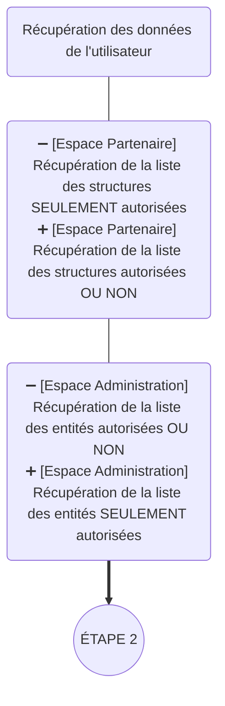
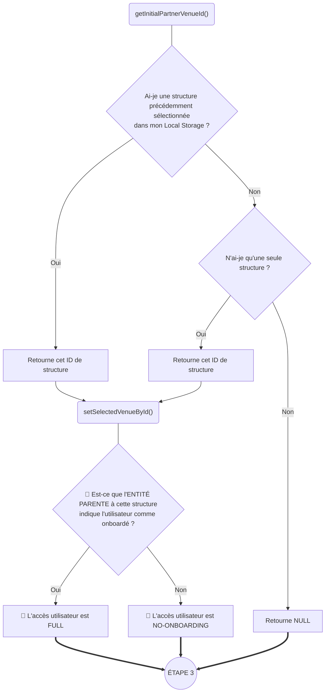
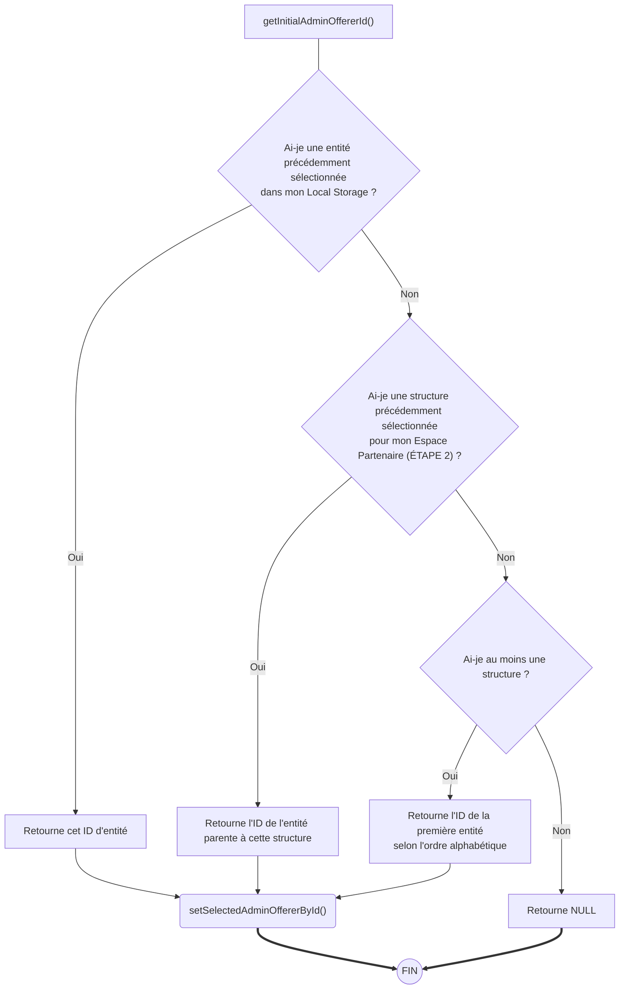

## Initialisation d'un utilisateur

Voici le nouveau flux d'initialisation d'un utilisateur sous le FF `WIP_SWITCH_VENUE`.

> [!CAUTION]
> Le cas des structures non-rattachées n'est pour l'instant pas traité.
> La solution la plus simple serait de retourner une propriété `isAllowed` sur la liste légère des structures.
> La liste légère des structures n'a besoin de comporter que 4 propriétés pour éviter tout risque d'exposition de données :
> - `id`: ID de la structure.
> - `publicName`: Nom public de la structure.
> - `address`: Présente si `isAllowed` est TRUE, nulle si `isAllowed` est FALSE.
> - `isAllowed`: Booléen n'indiquant que le fait qu'elle soit autorisée ou non pour cet utilisateur (sans détail sur la raison).

**Signification des emojis**
- ➖ / ➕ : Choix ou Déclaration Legacy qui va être remplacé
- 📛 : Choix ou Déclaration Legacy qui va être supprimé

### Étape 1 - Initialisation des données de l'utilisateur

### Étape 2 - [Espace Partenaire] Initialisation de la structure sélectionnée

### Étape 3 - [Espace Administration] Initialisation de l'entité sélectionnée

